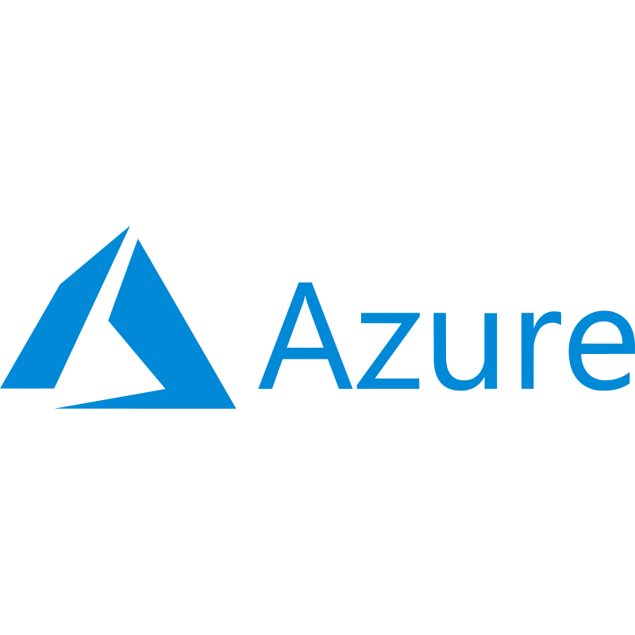
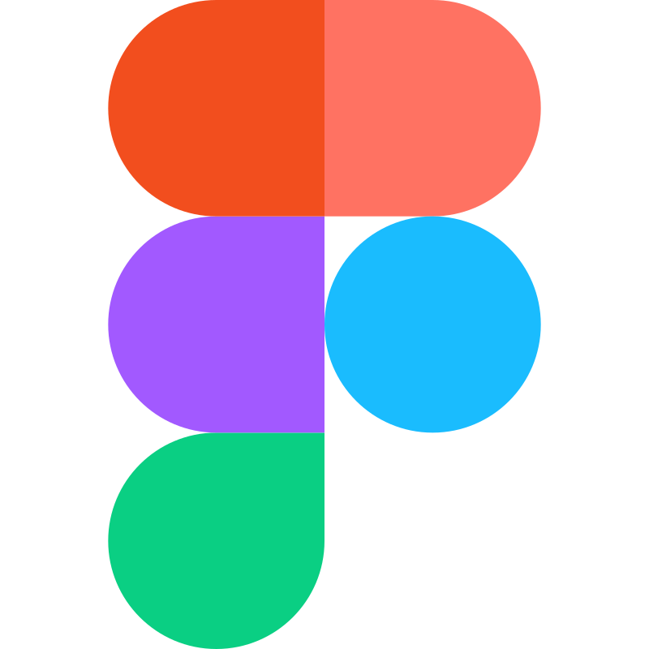
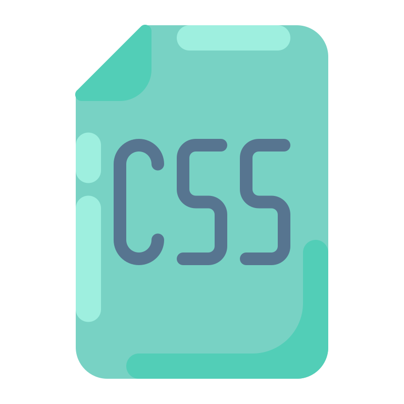

  <h1>
    
  </h1>
  
  
  
  <h3>🚀 Passionate Software Engineer | AWS Solutions Architect | Problem Solver 🧠</h3>
  
<em>Turning coffee into code, one algorithm at a time ☕️→💻</em>

  
  🎯 **Currently seeking Full-Time opportunities as a Software Engineer/Solutions Architect**
  
  💡 **Ask me about:** Data Structures & Algorithms, AWS Architecture, Full-Stack Development
  
  🤔 **Philosophy:** "The code works, but is it scalable, maintainable, and efficient?"
  
  🏆 **AWS Certified Solutions Architect Associate (SAA-C03)** | Score: 930/1000 🎉
  

---

## 🛠️ **Tech Stack** 

<table>
<tr>
<td valign="top" width="33%">

### ☁️ **Cloud & DevOps**

### 🗄️ **Databases**

### 🎨 **Design Tools**

</td>
<td valign="top" width="33%">

### 💻 **Languages & Frameworks**

### 📱 **Mobile & CMS**

</td>
<td valign="top" width="33%">

### 🔧 **Tools & Automation**

### 📊 **Business & Analytics**

### 🏆 **Certifications**
🎖️ **AWS Solutions Architect Associate (SAA-C03)** - 930/1000  
📊 **Business Analytics**  
🔍 **SEO & Digital Marketing**  
🎨 **UI/UX Design**

</td>
</tr>
</table>

---

## 🤝 **Let's Connect & Collaborate**

  

**💬 "Code is like humor. When you have to explain it, it's bad." - Cory House**

 <em><b>Happy coding!</b></em> 

